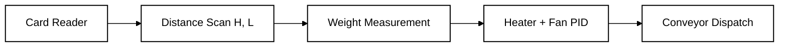
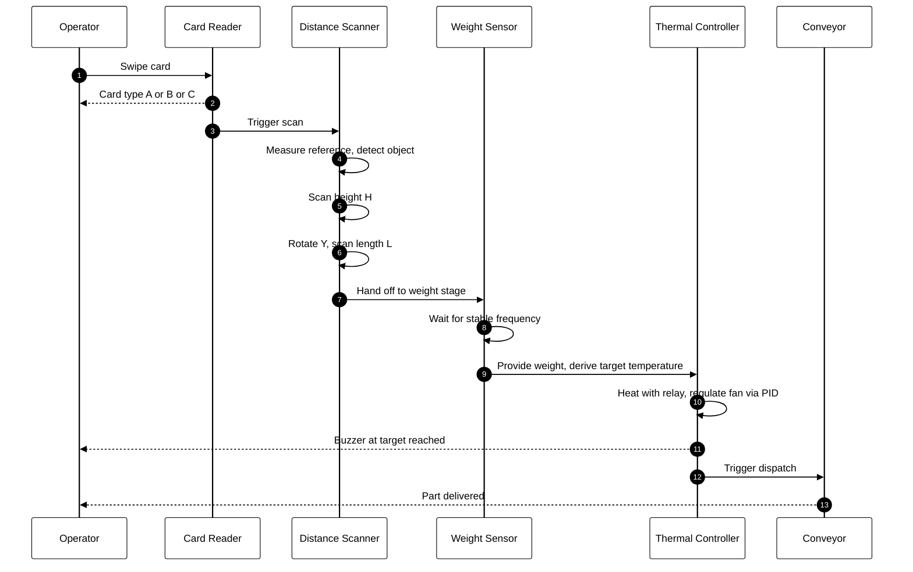

# INC-MINI-Project

An integrated Arduino-based automation cell that authenticates an access card, scans a part for height and length, weighs it via an LC oscillator with FFT-based frequency estimation, drives the part to a target temperature with closed-loop fan and heater control, and dispatches it on a conveyor.

The system runs as a single deterministic state machine on an Arduino Mega 2560.

---

## Table of Contents

- [Overview](#overview)
- [Hardware](#hardware)
- [Pin Map](#pin-map)
- [Process Flow](#process-flow)
- [State Machine](#state-machine)
- [Subsystems](#subsystems)
- [Repository Layout](#repository-layout)
- [Build and Upload](#build-and-upload)
- [Calibration](#calibration)
- [Tools](#tools)
- [Test Sketches](#test-sketches)
- [License](#license)

---

## Overview



| Stage | Purpose | Primary Sensors / Actuators |
|---|---|---|
| Card | Authenticate card type A, B, or C | LDR clock and data, indicator LED |
| Scan | Measure height H and length L | VL53L0X, two servos |
| Weight | Estimate part weight from oscillator frequency | LC tank into A0, FFT |
| Thermal | Drive temperature to target with active cooling | DS18B20, relay heater, PWM fan with PID |
| Dispatch | Move finished part out of the cell | DC motor with H-bridge |

---

## Hardware

- Arduino Mega 2560
- Adafruit VL53L0X time-of-flight distance sensor (I2C)
- DS18B20 temperature sensor (1-wire)
- LC oscillator front-end into ADC pin A0
- Hall or optical fan tachometer into A2
- 4-wire PC fan driven from Timer1 10-bit fast PWM at 31.25 kHz
- SSR or mechanical relay driving a heating element
- DC gear motor on H-bridge (ENA, IN1, IN2)
- Two hobby servos for X scan axis and Y rotation
- LDR-based card reader with three slots (clock, data, color)
- Three TM1637 4-digit 7-segment displays
- Buzzer, three status LEDs, one card indicator LED

---

## Pin Map

```mermaid
%%{init: {'theme':'base','themeVariables':{'primaryColor':'#ffffff','primaryBorderColor':'#000000','primaryTextColor':'#000000','lineColor':'#000000','secondaryColor':'#f5f5f5','clusterBkg':'#fafafa','clusterBorder':'#000000'}}}%%
flowchart LR
    subgraph MCU[Arduino Mega 2560]
      M1[A0 FFT ADC]
      M2[A2 Fan Tacho]
      M3[A4..A6 LDR Card]
      M4[D11 PWM Fan]
      M5[D10 DS18B20]
      M6[D12 Relay]
      M7[D9 Buzzer]
      M8[D8..D6 LEDs]
      M9[D5..D3 Motor]
      M10[D44..D45 Servos]
      M11[D22..D32 TM1637]
      M12[D13 Card LED]
    end

    classDef mcu fill:#ffffff,stroke:#000000,stroke-width:1.2px,color:#000000;
    class M1,M2,M3,M4,M5,M6,M7,M8,M9,M10,M11,M12 mcu;
```



| Function | Pin | Notes |
|---|---|---|
| LC oscillator ADC | A0 | analog input for FFT |
| Fan tachometer | A2 | analog input, pulse counted with hysteresis |
| Card LDR clock | A4 | hole pattern timing |
| Card LDR data | A5 | hole pattern bits |
| Card LDR color | A6 | reserved for color sensing |
| PWM fan | D11 | Timer1 OC1A, 10-bit fast PWM |
| DS18B20 | D10 | OneWire bus |
| Relay heater | D12 | active LOW |
| Buzzer | D9 | status tone |
| LED card A | D8 | indicator |
| LED card B | D7 | indicator |
| LED card C | D6 | indicator |
| Motor ENA | D5 | PWM speed |
| Motor IN1 | D4 | direction |
| Motor IN2 | D3 | direction |
| Servo X | D44 | scan axis |
| Servo Y | D45 | rotation axis |
| Card indicator LED | D13 | active during read |
| Display 1 CLK / DIO | D22 / D24 | TM1637 |
| Display 2 CLK / DIO | D26 / D28 | TM1637 |
| Display 3 CLK / DIO | D30 / D32 | TM1637 |

The sketch includes pin definitions at the top of `firmware/main/main.ino`. Adjust them there if the wiring on your bench differs.

---

## Process Flow



---

## State Machine

```mermaid
%%{init: {'theme':'base','themeVariables':{'primaryColor':'#ffffff','primaryBorderColor':'#000000','primaryTextColor':'#000000','lineColor':'#000000','secondaryColor':'#f5f5f5','clusterBkg':'#fafafa','clusterBorder':'#000000'}}}%%
stateDiagram-v2
    direction LR
    [*] --> FAN_CALIB
    FAN_CALIB --> WEIGHT_ZERO_CALIB: tachometer baseline ready
    WEIGHT_ZERO_CALIB --> WAIT_CARD: zero offset stored
    WAIT_CARD --> REF_DIST_1: card pattern matched
    REF_DIST_1 --> WAIT_OBJECT: reference distance captured
    WAIT_OBJECT --> SCAN_HEIGHT: object confirmed
    SCAN_HEIGHT --> ROTATE_Y
    ROTATE_Y --> REF_DIST_2
    REF_DIST_2 --> SCAN_LENGTH
    SCAN_LENGTH --> WAIT_WEIGHT
    WAIT_WEIGHT --> HEATING: weight stable for 3 s
    HEATING --> CONVEYOR: temperature reached
    CONVEYOR --> DONE
    DONE --> WAIT_CARD: cycle reset
```



The full enumeration lives in `firmware/main/main.ino`:

```
STATE_INIT, STATE_FAN_CALIB, STATE_WEIGHT_ZERO_CALIB,
STATE_WAIT_CARD, STATE_REF_DIST_1, STATE_WAIT_OBJECT,
STATE_SCAN_HEIGHT, STATE_ROTATE_Y, STATE_REF_DIST_2,
STATE_SCAN_LENGTH, STATE_WAIT_WEIGHT, STATE_HEATING,
STATE_CONVEYOR, STATE_DONE
```

---

## Subsystems

### Weight Estimation

The LC oscillator output is sampled at A0 with a fixed period of 500 microseconds. A 128-point FFT extracts the dominant tone, refined by parabolic peak interpolation. An exponential moving average smooths frequency between cycles.

The frequency-to-weight mapping uses a quadratic model fitted from bench data:

```
f = A * w^2 + B * w + C
A = 3.768e-4
B = -2.523e-3
C = 451.32
```

Inversion uses the closed form

```
w = (-B + sqrt(B^2 - 4 * A * (C - f))) / (2 * A)
```

A four-second zero-offset routine runs at boot. The mean frequency at zero load is captured and stored as `zeroOffset`, which is subtracted from every subsequent reading before the inverse mapping is applied.

### Fan Speed Control

A 10-bit fast PWM on Timer1 drives the fan at 31.25 kHz to keep audible noise out of the motor. Tachometer pulses are detected on A2 with adaptive thresholding and hysteresis. Pulses convert to revolutions per second using the configured pole count. A discrete PID loop runs every 20 ms with anti-windup on the integral term.

### Thermal Control

Temperature is read from a DS18B20 over OneWire once per second. The relay drives a heater with a small hysteresis band defined by `marginOn` and `marginOff` to avoid chattering. The target is derived from measured weight:

```
T_target = 0.025 * weight + 30
```

The buzzer pulses at 300 ms while heating and emits a 3-second tone when the target is reached.

### Distance and Geometry

The VL53L0X provides millimeter-resolution distance. A reference background distance is averaged over ten stable reads. An object is confirmed when three consecutive deltas exceed 5 mm. The scan axis sweeps the X servo across an 80-step arc, capturing the maximum vertical or longitudinal extent relative to the reference plane.

### Card Reader

Two LDRs read a clock pattern and a data pattern punched into a swipe card. The clock channel uses a 30 ms debounce and edge detection. Ten data bits are sampled on each clock rising edge and compared against three reference patterns A, B, and C. A successful match latches the corresponding indicator LED.

### Conveyor

A DC motor on an H-bridge runs forward at a fixed PWM for five seconds to deliver the finished part. The fan PID and tachometer keep running during dispatch.

---

## Repository Layout

```
inc-mini-project/
├── README.md
├── .gitignore
├── docs/
│   └── images/
│       ├── analysis_result.png
│       ├── pattern_model.png
│       └── plot_output.png
├── firmware/
│   ├── main/
│   │   └── main.ino
│   └── tests/
│       ├── test_weight_fft/
│       │   └── test_weight_fft.ino
│       ├── test_weight_display/
│       │   └── test_weight_display.ino
│       ├── test_weight_counter/
│       │   └── test_weight_counter.ino
│       └── test_motor/
│           └── test_motor.ino
└── tools/
    ├── collect_training_data.py
    ├── plot_graph.py
    └── realtime_plot.py
```

---

## Build and Upload

The production sketch is `firmware/main/main.ino`. Open it from the Arduino IDE or `arduino-cli` and target an Arduino Mega 2560.

Required libraries:

- `arduinoFFT` by Enrique Condes
- `OneWire` by Paul Stoffregen
- `Adafruit_VL53L0X` by Adafruit
- `Servo` (bundled with the IDE)

Example with `arduino-cli`:

```bash
arduino-cli core install arduino:avr
arduino-cli lib install "arduinoFFT" "OneWire" "Adafruit VL53L0X"
arduino-cli compile --fqbn arduino:avr:mega firmware/main
arduino-cli upload --fqbn arduino:avr:mega -p COM5 firmware/main
```

Replace `COM5` with the serial port assigned to your board. Serial console runs at 115200 baud.

---

## Calibration

The system performs two automatic calibrations at boot.

| Stage | Duration | What it measures | Where it is stored |
|---|---|---|---|
| Fan tachometer baseline | 3 s | min and max ADC values on A2 | `sensorMin`, `sensorMax` |
| Weight zero offset | 4 s | mean FFT frequency with no load | `zeroFreq`, `zeroOffset` |

Total cold-start time is approximately 7 seconds before the cell accepts a card.

To re-fit the weight model, capture frequency and weight pairs with `tools/collect_training_data.py`, run a polynomial fit in `tools/plot_graph.py`, and update `MODEL_A`, `MODEL_B`, `MODEL_C` near the top of `firmware/main/main.ino`.

---

## Tools

The `tools/` folder contains companion Python scripts. They are optional and run on a host PC connected to the Arduino over serial.

| Script | Purpose |
|---|---|
| `collect_training_data.py` | Interactive data collector. Records peak frequency, area under curve, rise and decay times against a known weight into a CSV file. |
| `plot_graph.py` | Loads a captured CSV, fits an exponential decay model, and prints constants ready to paste into the firmware. |
| `realtime_plot.py` | Live plot of frequency and inferred weight using a cubic calibration model. Useful when tuning the LC front-end. |

Dependencies:

```bash
pip install pyserial numpy pandas matplotlib scipy
```

Edit the `PORT` constant inside each script to match your serial port before running.

---

## Test Sketches

Each subfolder under `firmware/tests/` is a self-contained sketch that isolates a single subsystem. Use these to validate hardware in stages before flashing the integrated firmware.

| Sketch | Subsystem | Notes |
|---|---|---|
| `test_weight_fft` | LC oscillator and FFT | Streams filtered frequency, baseline, and delta over serial |
| `test_weight_display` | Quadratic weight model and TM1637 | Includes drift compensation and 7-segment output |
| `test_weight_counter` | Peak-to-peak amplitude counter | Bench utility used to cross-check the FFT path |
| `test_motor` | Fan PID and 10-bit PWM | Reports measured RPS and target RPS over serial |

Open each as its own sketch in the Arduino IDE.

---

## License

Add a license file to clarify reuse terms. MIT or Apache 2.0 are common choices for open hardware projects.
