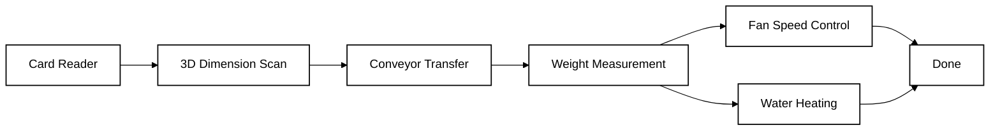
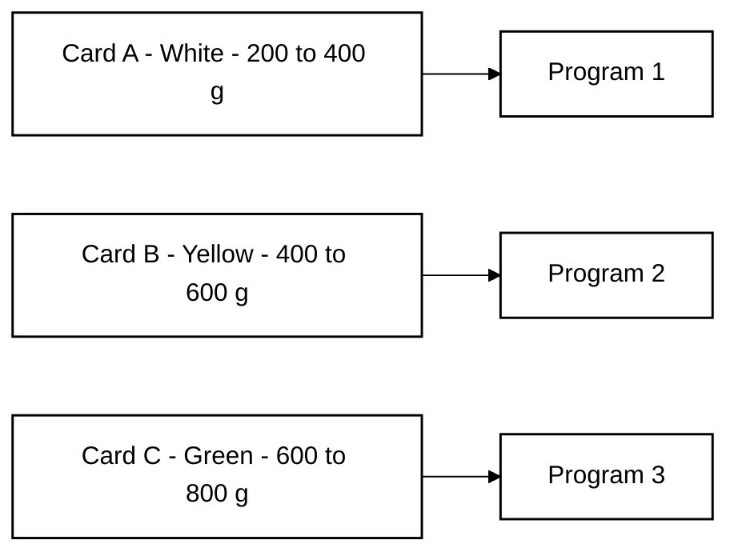
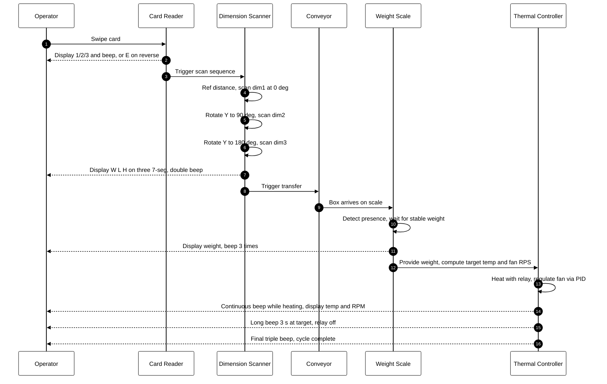

# INC-MINI-Project

An integrated Arduino-based automation cell that authenticates an access card, scans a box for three dimensions using a single distance sensor, weighs it via an LC oscillator with FFT-based frequency estimation, drives a fan proportional to weight, heats water to a target temperature, and dispatches the box on a conveyor.

The system runs as a single deterministic state machine on an Arduino Mega 2560.

---

## Table of Contents

- [Overview](#overview)
- [Hardware](#hardware)
- [Pin Map](#pin-map)
- [Card Types](#card-types)
- [Process Flow](#process-flow)
- [State Machine](#state-machine)
- [Subsystems](#subsystems)
- [Repository Layout](#repository-layout)
- [Build and Upload](#build-and-upload)
- [Calibration](#calibration)
- [Tools](#tools)
- [Test Sketches](#test-sketches)

---

## Overview



| Stage | Spec requirement | Implementation |
|---|---|---|
| Card | Swipe card A/B/C, display 1/2/3, beep on success, display E on reverse | LDR clock/data/color, pattern match |
| Scan | Measure W, L, H with one sensor, display each in mm resolution | VL53L0X + X servo sweep, Y servo rotates box 0/90/180 deg |
| Transfer | Move box from scan platform to scale automatically | DC motor conveyor 4 s |
| Weight | Estimate weight 200-800 g, display in 10 g resolution | LC oscillator + FFT, zero-offset calibration at boot |
| Fan | Speed proportional to weight: 200 g = 1 RPS, 800 g = 20 RPS | Timer1 10-bit PWM, PID, display RPM |
| Heating | Target temp proportional to weight: 200 g = 35 C, 800 g = 50 C | DS18B20, relay, display target and current temp |
| Dispatch | Conveyor step-pattern after heating complete | DC motor 15-cycle step pattern |

---

## Hardware

- Arduino Mega 2560
- Adafruit VL53L0X time-of-flight distance sensor (I2C)
- DS18B20 temperature sensor (1-wire)
- LC oscillator front-end into ADC pin A0
- Hall or optical fan tachometer into A2
- 4-wire PC fan driven from Timer1 10-bit fast PWM at 31.25 kHz
- SSR or mechanical relay driving a 220 V 150 W kettle
- DC gear motor on H-bridge (ENA, IN1, IN2)
- Servo X for distance scan sweep (60-120 degrees)
- Servo Y for box rotation (0, 90, 180 degrees)
- LDR-based card reader with three slots (clock A8, data A9, color A10)
- Three TM1637 4-digit 7-segment displays
- Buzzer
- LED card indicator (D8), LED scan indicator (D7), LED weigh indicator (D6)
- LED kettle status (A3)

---

## Pin Map

```mermaid
%%{init: {'theme':'base','themeVariables':{'primaryColor':'#ffffff','primaryBorderColor':'#000000','primaryTextColor':'#000000','lineColor':'#000000','secondaryColor':'#f5f5f5','clusterBkg':'#fafafa','clusterBorder':'#000000'}}}%%
flowchart LR
    subgraph MCU[Arduino Mega 2560]
      M1[A0 FFT ADC]
      M2[A2 Fan Tacho]
      M3[A8 LDR Clock]
      M4[A9 LDR Data]
      M5[A10 LDR Color]
      M6[A3 Kettle LED]
      M7[D11 PWM Fan]
      M8[D10 DS18B20]
      M9[D12 Relay]
      M10[D9 Buzzer]
      M11[D8 LED Card]
      M12[D7 LED Scan]
      M13[D6 LED Weigh]
      M14[D5..D3 Motor]
      M15[D44..D45 Servos]
      M16[D22..D32 TM1637]
    end

    classDef mcu fill:#ffffff,stroke:#000000,stroke-width:1.2px,color:#000000;
    class M1,M2,M3,M4,M5,M6,M7,M8,M9,M10,M11,M12,M13,M14,M15,M16 mcu;
```



| Function | Pin | Notes |
|---|---|---|
| LC oscillator ADC | A0 | analog input for FFT |
| Fan tachometer | A2 | analog input, pulse counted with hysteresis |
| Card LDR clock | A8 | hole pattern timing |
| Card LDR data | A9 | hole pattern bits |
| Card LDR color | A10 | color identification and removal detection |
| Kettle status LED | A3 | HIGH while relay is ON |
| PWM fan | D11 | Timer1 OC1A, 10-bit fast PWM 31.25 kHz |
| DS18B20 | D10 | OneWire bus |
| Relay kettle | D12 | active LOW |
| Buzzer | D9 | status tones |
| LED card system | D8 | blink 2 Hz idle, solid during read, blink 2 Hz after success |
| LED scan system | D7 | blink 0.25 Hz waiting, blink 0.5 Hz scanning, solid done |
| LED weigh system | D6 | off until box on scale, blink 1 Hz weighing, blink 0.25 Hz done |
| Motor ENA | D5 | PWM speed |
| Motor IN1 | D4 | direction |
| Motor IN2 | D3 | direction |
| Servo X | D44 | scan sweep axis |
| Servo Y | D45 | box rotation axis |
| Display 1 CLK / DIO | D22 / D24 | TM1637 |
| Display 2 CLK / DIO | D26 / D28 | TM1637 |
| Display 3 CLK / DIO | D30 / D32 | TM1637 |

---

## Card Types



| Card | Color | Weight range | Display | Pattern |
|---|---|---|---|---|
| A | White | 200-400 g | 1 | 0101010111 |
| B | Yellow | 400-600 g | 2 | 0101100111 |
| C | Green | 600-800 g | 3 | 0100110111 |
| Reversed | any | - | E | any reversed pattern |

---

## Process Flow



---

## State Machine

```mermaid
%%{init: {'theme':'base','themeVariables':{'primaryColor':'#ffffff','primaryBorderColor':'#000000','primaryTextColor':'#000000','lineColor':'#000000','secondaryColor':'#f5f5f5','clusterBkg':'#fafafa','clusterBorder':'#000000'}}}%%
stateDiagram-v2
    direction LR
    [*] --> FAN_CALIB
    FAN_CALIB --> WEIGHT_ZERO_CALIB: fan sensor ready
    WEIGHT_ZERO_CALIB --> WAIT_CARD: zero offset stored
    WAIT_CARD --> CARD_VALID_DISPLAY: pattern matched
    WAIT_CARD --> CARD_INVALID_DISPLAY: reversed or unknown
    CARD_INVALID_DISPLAY --> WAIT_CARD: 2 s timeout
    CARD_VALID_DISPLAY --> WAIT_OBJECT: 2 s display
    WAIT_OBJECT --> REF_DIST: object detected
    REF_DIST --> SCAN_DIM1
    SCAN_DIM1 --> ROTATE_TO_DIM2
    ROTATE_TO_DIM2 --> SCAN_DIM2
    SCAN_DIM2 --> ROTATE_TO_DIM3
    ROTATE_TO_DIM3 --> SCAN_DIM3
    SCAN_DIM3 --> SCAN_DONE
    SCAN_DONE --> TRANSFER_TO_SCALE
    TRANSFER_TO_SCALE --> WAIT_ON_SCALE
    WAIT_ON_SCALE --> WEIGHING: box detected on scale
    WEIGHING --> WEIGH_DONE: weight stable 3 s
    WEIGH_DONE --> HEATING: after beep sequence
    HEATING --> BOIL_COMPLETE: temperature reached
    BOIL_COMPLETE --> DONE: final beep
    DONE --> WAIT_CARD: cycle reset
```



Full enum in `firmware/main/main.ino`:

```
STATE_FAN_CALIB, STATE_WEIGHT_ZERO_CALIB,
STATE_WAIT_CARD, STATE_CARD_VALID_DISPLAY, STATE_CARD_INVALID_DISPLAY,
STATE_WAIT_OBJECT, STATE_REF_DIST,
STATE_SCAN_DIM1, STATE_ROTATE_TO_DIM2, STATE_SCAN_DIM2,
STATE_ROTATE_TO_DIM3, STATE_SCAN_DIM3, STATE_SCAN_DONE,
STATE_TRANSFER_TO_SCALE, STATE_WAIT_ON_SCALE,
STATE_WEIGHING, STATE_WEIGH_DONE,
STATE_HEATING, STATE_BOIL_COMPLETE, STATE_DONE
```

---

## Subsystems

### Card Reader

Three LDRs read clock, data, and color tracks from a swipe card. The clock channel triggers on a falling edge below ADC 500. Ten data bits are sampled on each clock rising edge and compared against patterns for cards A, B, and C. A reversed card is detected by checking all three patterns against the bit-reversed input. A successful match shows 1/2/3 on display 1 with a short beep. A reversed or unknown card shows E with a long beep. A removal protection timer resets the reader if the color channel rises during a read.

LED card behavior:
- Idle: blink 2 Hz, display shows dash
- Card inserted: solid
- Read success: blink 2 Hz, display shows 1/2/3
- Read error: display shows E, returns to idle after 2 s

### Dimension Scanner

The VL53L0X measures distance with millimeter resolution. A reference background is averaged over ten stable reads. An object is confirmed when two consecutive deltas exceed 1 cm. The X servo sweeps from 60 to 120 degrees and back, recording the maximum protrusion above the reference plane. The Y servo rotates the box platform to 0, 90, and 180 degrees to expose three orthogonal faces to the same sensor. Results are displayed on all three 7-segment displays in centimeters with 1 mm resolution (format XX.XX).

LED scan behavior:
- Waiting for box: blink 0.25 Hz
- Scanning: blink 0.5 Hz with continuous buzzer
- Done: solid, double beep

### Weight Estimation

The LC oscillator output is sampled at A0 with a 500 microsecond period. A 128-point FFT with Hamming windowing extracts the dominant tone, refined by parabolic peak interpolation. An exponential moving average smooths frequency between cycles.

A four-second zero-offset routine runs at boot. The mean frequency at zero load is stored as `zeroFreq`. Every subsequent reading subtracts `zeroOffset = zeroFreq - MODEL_C` before the inverse quadratic mapping:

```
w = (-B + sqrt(B^2 - 4A(C - f_corrected))) / (2A)
A = 3.768e-4,  B = -2.523e-3,  C = 451.32
```

Box presence on the scale is detected when the measured frequency deviates from `zeroFreq` by more than 2 Hz.

Weight is displayed in 10 g resolution. After three stable seconds, three beeps confirm the reading.

LED weigh behavior:
- No box: off
- Box present, weighing: blink 1 Hz
- Weight confirmed: blink 0.25 Hz, beep 3 times

### Fan Speed Control

Fan target RPS is mapped linearly from weight:

```
200 g -> 1 RPS
800 g -> 20 RPS
targetRPS = 1 + (weight - 200) * 19 / 600
```

A 10-bit fast PWM on Timer1 drives the fan at 31.25 kHz. Tachometer pulses on A2 are detected with adaptive hysteresis. A discrete PID loop runs every 20 ms with anti-windup. RPM (= RPS x 60) is displayed on display 3 during heating.

### Thermal Control

Target temperature is mapped linearly from weight:

```
200 g -> 35 C
800 g -> 50 C
targetTemp = 35 + (weight - 200) * 15 / 600
```

DS18B20 is read once per second. The relay drives the kettle with a 1.0 / 0.3 degree hysteresis band. The kettle status LED mirrors the relay state. A continuous buzzer tone sounds during heating. When the target is reached the relay opens, the LED turns off, and a 3-second long beep fires. The current temperature remains on display 2 after heating ends.

### Conveyor

Transfer from scan platform to scale: forward at PWM 120 for 4 seconds.

Dispatch after heating: 15 step-cycles of backward 250 ms then forward 250 ms at PWM 100, followed by a final backward run at PWM 70 for 2 seconds. The fan PID keeps running during all conveyor operations.

---

## Repository Layout

```
inc-mini-project/
├── README.md
├── .gitignore
├── docs/
│   └── images/
│       ├── analysis_result.png
│       ├── pattern_model.png
│       └── plot_output.png
├── firmware/
│   ├── main/
│   │   └── main.ino
│   └── tests/
│       ├── test_weight_fft/
│       │   └── test_weight_fft.ino
│       ├── test_weight_display/
│       │   └── test_weight_display.ino
│       ├── test_weight_counter/
│       │   └── test_weight_counter.ino
│       └── test_motor/
│           └── test_motor.ino
└── tools/
    ├── collect_training_data.py
    ├── plot_graph.py
    └── realtime_plot.py
```

---

## Build and Upload

Open `firmware/main/main.ino` in the Arduino IDE and target Arduino Mega 2560.

Required libraries:

- `arduinoFFT` by Enrique Condes
- `OneWire` by Paul Stoffregen
- `Adafruit_VL53L0X` by Adafruit
- `Servo` (bundled with IDE)

With `arduino-cli`:

```bash
arduino-cli core install arduino:avr
arduino-cli lib install "arduinoFFT" "OneWire" "Adafruit VL53L0X"
arduino-cli compile --fqbn arduino:avr:mega firmware/main
arduino-cli upload --fqbn arduino:avr:mega -p COM5 firmware/main
```

Serial monitor at 115200 baud shows all state transitions and measured values.

---

## Calibration

| Stage | Duration | What it measures | Variable |
|---|---|---|---|
| Fan tachometer | 3 s | min and max ADC on A2 | `sensorMin`, `sensorMax` |
| Weight zero offset | 4 s | mean FFT frequency at zero load | `zeroFreq`, `zeroOffset` |

Total cold-start time before the cell accepts a card is approximately 7 seconds.

To re-fit the weight model, capture frequency and weight pairs with `tools/collect_training_data.py`, run `tools/plot_graph.py` to fit the quadratic, and update `MODEL_A`, `MODEL_B`, `MODEL_C` in `firmware/main/main.ino`.

---

## Tools

| Script | Purpose |
|---|---|
| `collect_training_data.py` | Records peak frequency and timing features against known weights into CSV |
| `plot_graph.py` | Fits exponential decay and prints constants for firmware |
| `realtime_plot.py` | Live frequency and weight plot using cubic calibration model |

```bash
pip install pyserial numpy pandas matplotlib scipy
```

Edit `PORT` in each script before running.

---

## Test Sketches

| Sketch | Subsystem | Notes |
|---|---|---|
| `test_weight_fft` | LC oscillator and FFT | Streams filtered frequency, baseline, and delta |
| `test_weight_display` | Quadratic weight model and TM1637 | Includes drift compensation |
| `test_weight_counter` | Peak-to-peak amplitude counter | Cross-check for FFT path |
| `test_motor` | Fan PID and 10-bit PWM | Reports measured and target RPS |
