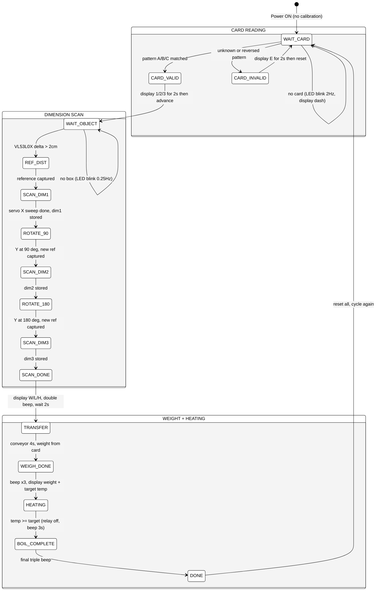
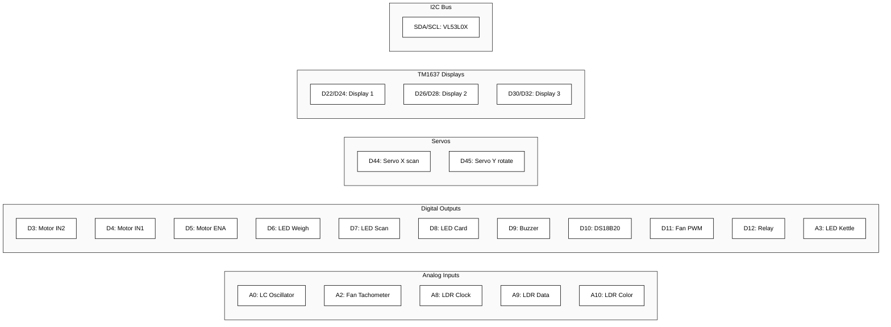
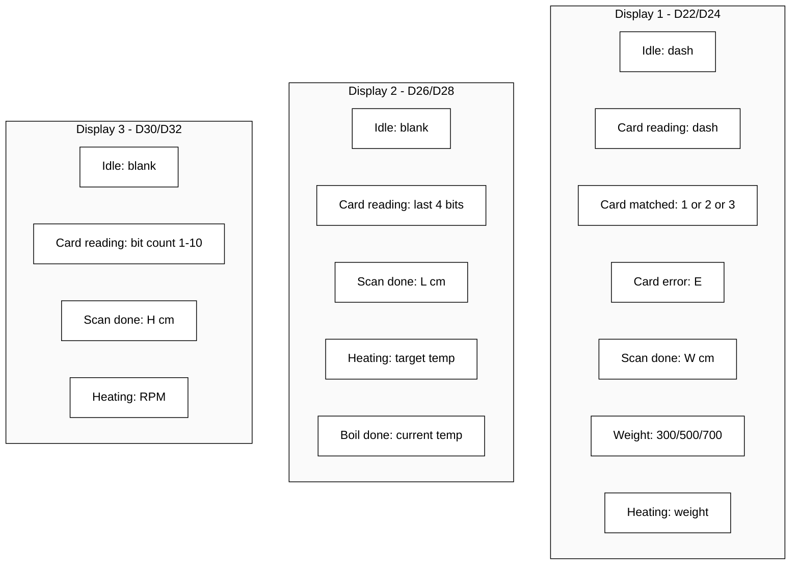
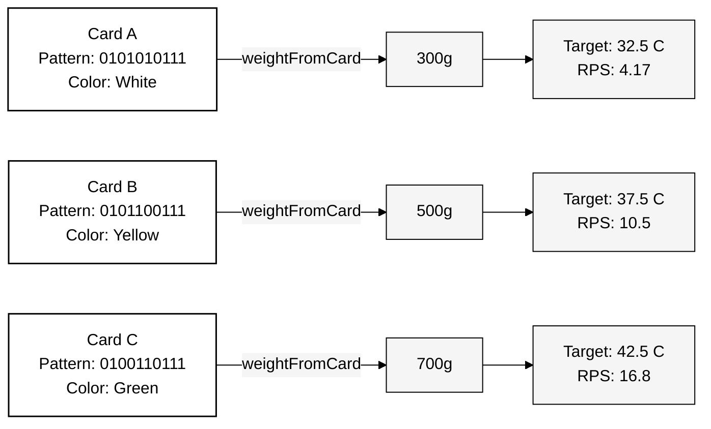
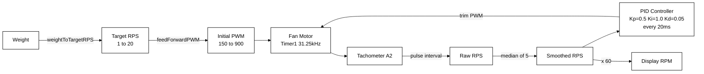
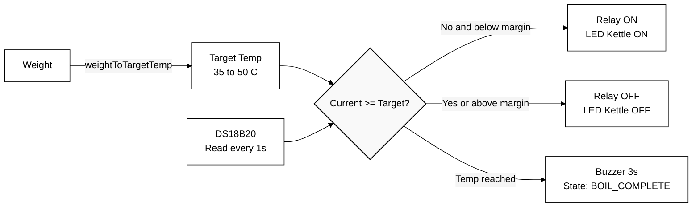

# System Diagram - main.ino

## Full State Machine (Detailed)

---

## Detailed Flow with Actions

```mermaid
%%{init: {'theme':'base','themeVariables':{'primaryColor':'#ffffff','primaryBorderColor':'#000000','primaryTextColor':'#000000','lineColor':'#000000','secondaryColor':'#f5f5f5','clusterBkg':'#fafafa','clusterBorder':'#000000'}}}%%
flowchart TD
    START([Power ON]) --> WC

    subgraph CARD[Card Reader Phase]
        WC[WAIT_CARD<br/>LED Card blink 2Hz<br/>Display 1: dash<br/>Display 2/3: blank]
        WC -->|LDR clock LOW| READING[Card Inserted<br/>LED Card solid<br/>Read 10 bits<br/>Display 2: last 4 bits<br/>Display 3: bit count]
        READING -->|pattern = A| VALID[CARD_VALID<br/>Display 1: 1<br/>Beep 150ms]
        READING -->|pattern = B| VALID2[CARD_VALID<br/>Display 1: 2<br/>Beep 150ms]
        READING -->|pattern = C| VALID3[CARD_VALID<br/>Display 1: 3<br/>Beep 150ms]
        READING -->|unknown/reversed| INVALID[CARD_INVALID<br/>Display 1: E<br/>Beep 500ms]
        INVALID -->|2s timeout| WC
        VALID --> WAIT2s[Wait 2 seconds]
        VALID2 --> WAIT2s
        VALID3 --> WAIT2s
    end

    WAIT2s --> WO

    subgraph SCAN[Dimension Scan Phase]
        WO[WAIT_OBJECT<br/>LED Scan blink 0.25Hz<br/>VL53L0X polling every 200ms]
        WO -->|delta > 2cm| REF[REF_DIST<br/>Average 10 readings x 50ms]
        REF --> D1[SCAN_DIM1<br/>LED Scan blink 0.5Hz<br/>Buzzer ON<br/>Servo X: 60 to 120 to 60<br/>Record max height]
        D1 --> R90[ROTATE_TO_DIM2<br/>Servo Y: 0 to 90 deg<br/>New reference]
        R90 --> D2[SCAN_DIM2<br/>Servo X sweep again]
        D2 --> R180[ROTATE_TO_DIM3<br/>Servo Y: 90 to 180 deg<br/>New reference]
        R180 --> D3[SCAN_DIM3<br/>Servo X sweep again]
        D3 --> DONE_SCAN[SCAN_DONE<br/>LED Scan solid<br/>Buzzer OFF<br/>Double beep<br/>Display 1: W cm<br/>Display 2: L cm<br/>Display 3: H cm<br/>Wait 2s]
    end

    DONE_SCAN --> XFER

    subgraph WEIGHT[Weight + Transfer Phase]
        XFER[TRANSFER_TO_SCALE<br/>Conveyor forward 4s @ PWM 120<br/>Weight = center of card range<br/>Card A: 300g<br/>Card B: 500g<br/>Card C: 700g<br/>Set fan PWM feed-forward<br/>Reset PID]
        XFER --> WD[WEIGH_DONE<br/>LED Weigh blink 0.25Hz<br/>Display 1: weight in 10g<br/>Beep x3]
    end

    WD --> HEAT

    subgraph THERMAL[Heating Phase]
        HEAT[HEATING<br/>Relay ON<br/>LED Kettle ON<br/>Buzzer blink 300ms<br/>Fan PID running<br/>Display 1: weight<br/>Display 2: target temp<br/>Display 3: RPM]
        HEAT -->|temp >= target| BC[BOIL_COMPLETE<br/>Relay OFF<br/>LED Kettle OFF<br/>Buzzer 3s long<br/>Display 2: current temp]
        BC -->|2s| FINAL[DONE<br/>Triple beep<br/>All displays: DONE<br/>Wait 5s]
    end

    FINAL -->|reset| WC

    classDef phase fill:#ffffff,stroke:#000000,stroke-width:1.5px,color:#000000;
    classDef action fill:#f9f9f9,stroke:#333333,stroke-width:1px,color:#000000;
    class WC,READING,VALID,VALID2,VALID3,INVALID,WAIT2s action;
    class WO,REF,D1,R90,D2,R180,D3,DONE_SCAN action;
    class XFER,WD action;
    class HEAT,BC,FINAL action;
```

---

## Pin Wiring Diagram

---

## Display Content by State

---

## Weight Resolution Logic

---

## Fan Control Pipeline

---

## Thermal Control Pipeline

---

## LED Behaviour Summary

```mermaid
%%{init: {'theme':'base','themeVariables':{'primaryColor':'#ffffff','primaryBorderColor':'#000000','primaryTextColor':'#000000','lineColor':'#000000','secondaryColor':'#f5f5f5','clusterBkg':'#fafafa','clusterBorder':'#000000'}}}%%
gantt
    title LED States Through Process
    dateFormat X
    axisFormat %s

    section LED Card D8
    Blink 2Hz (idle)       :0, 10
    Solid (card in)        :10, 15
    Blink 2Hz (success)    :15, 20
    Off                    :20, 100

    section LED Scan D7
    Off                    :0, 20
    Blink 0.25Hz (wait)    :20, 30
    Blink 0.5Hz (scanning) :30, 60
    Solid (done)           :60, 65
    Blink 0.25Hz           :65, 70
    Off                    :70, 100

    section LED Weigh D6
    Off                    :0, 65
    Blink 1Hz (transfer)   :65, 70
    Blink 0.25Hz (done)    :70, 75
    Off                    :75, 100

    section LED Kettle A3
    Off                    :0, 75
    Solid (heating)        :75, 95
    Off (done)             :95, 100
```

---

## Timing Estimate (Typical Cycle)

| Phase | Duration | Notes |
|---|---|---|
| Boot to ready | instant | no calibration |
| Card swipe | 1-3 s | depends on swipe speed |
| Card display | 2 s | fixed |
| Wait for box | user dependent | until box placed |
| Reference capture | 2.5 s | 10 x 50ms + readStable |
| Scan dim1 | ~8 s | 120 steps x (40ms + 50ms readStable) |
| Rotate Y 90 | ~2 s | 90 steps x 15ms + 500ms settle |
| Scan dim2 | ~8 s | same |
| Rotate Y 180 | ~2 s | 90 steps |
| Scan dim3 | ~8 s | same |
| Display result | 2 s | fixed |
| Conveyor transfer | 4 s | fixed |
| Weight beep | 2.5 s | 3 beeps + wait |
| Heating | variable | depends on water temp and target |
| Boil complete | 5 s | 3s beep + 2s wait |
| Done display | 5 s | fixed |
| **Total (excl. heating)** | **~50 s** | |
